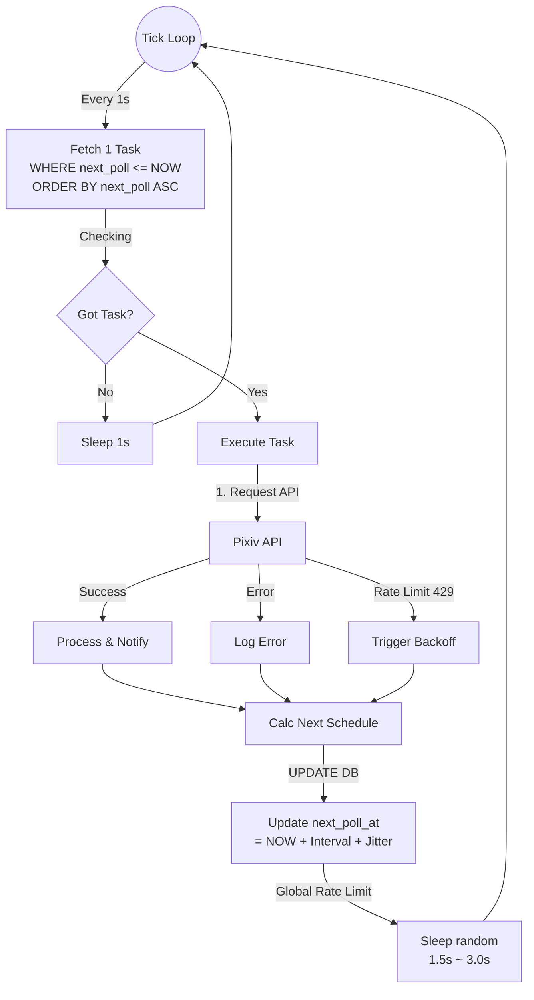
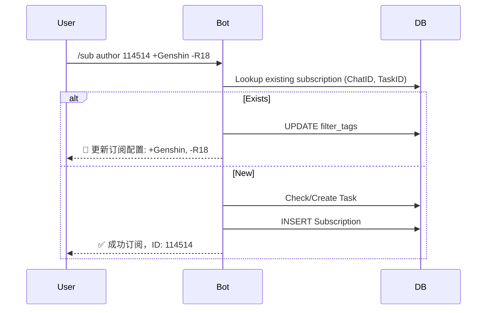
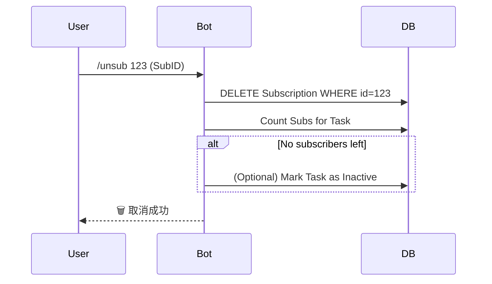

# PixivBot 技术设计方案

## 1. 项目概述
本项目旨在创建一个基于 Telegram 的 Pixiv 订阅机器人。用户可以通过 Bot 订阅自己喜爱的 Pixiv 画师，当画师发布新作品时，Bot 会自动抓取原图并推送到用户的 Telegram 聊天中。

项目采用 **Rust** 语言编写，追求高性能、低资源占用和类型安全。支持 Docker 部署，使用 SQLite 作为默认数据库（未来支持扩展）。

## 2. 技术栈选择

| 组件 | 技术选型 | 说明 |
| :--- | :--- | :--- |
| **编程语言** | Rust (2021 Edition) | 内存安全，高性能二进制 |
| **Bot 框架** | `teloxide` | 功能完整的 Telegram Bot API 封装 |
| **Pixiv API** | 自实现框架层 (`src/pixiv_client`) | 参考 [pixivpy](https://github.com/upbit/pixivpy) 重新实现，感谢原作者 @upbit |
| **HTTP 客户端** | `reqwest` | 用于 Pixiv API 调用和图片下载 |
| **数据库 ORM** | `sea-orm` | 异步动态 ORM，解耦具体数据库实现，支持 MySQL/Postgres/SQLite |
| **数据库驱动** | `sqlx` (SQLite) | `sea-orm` 的底层引擎 |
| **配置管理** | `config` | 支持 TOML 文件及环境变量注入 |
| **日志系统** | `tracing` | 支持结构化日志，同时输出到控制台和文件 |
| **定时任务** | `tokio-cron-scheduler` | 处理定时的画师作品轮询任务 |
| **限流控制** | `governor` | 防止 Pixiv API 风控，使用 GCRA 算法 |
| **异步运行时** | `tokio` | Rust 标准异步运行时 |

添加依赖时，必须使用cargo add命令，以使用最新版本，禁止手动修改Cargo.toml文件进行依赖添加。
对与用法上的疑问，请查看docs.rs上的相关文档。

## 3. 核心模块设计

### 3.1 目录结构
```text
src/
├── main.rs           # 程序入口
├── config.rs         # 基础配置 (Token, Log Level)
├── error.rs          # 统一错误处理
├── db/               # 数据库层
│   ├── mod.rs
│   ├── entities/     # SeaORM 实体 (Chats, Tasks, Subscriptions)
│   └── repo.rs       # 封装 DB 操作
├── pixiv_client/     # Pixiv API 框架层 (干净、独立)
│   ├── mod.rs        # 模块导出
│   ├── error.rs      # 错误类型
│   ├── models.rs     # 数据模型 (Illust, User, etc.)
│   ├── auth.rs       # OAuth 认证
│   └── client.rs     # API 客户端 (user_illusts, illust_ranking, etc.)
├── pixiv/            # Pixiv 业务层 (封装 pixiv_client)
│   ├── client.rs     # 业务适配层
│   ├── model.rs      # 业务模型
│   └── downloader.rs # 图片下载和缓存
├── bot/              # Telegram Bot 层
│   ├── commands.rs   # 指令解析 (/sub, /list, /setting)
│   └── notifier.rs   # 消息推送逻辑
└── scheduler/        # 动态任务调度层
    ├── mod.rs
    └── engine.rs     # 基于 DB 的任务分发引擎
```

### 3.2 数据库设计 (Revised Schema)

为了支持灵活的订阅模式和基于任务的调度，我们需要重构数据库设计，采用 **Chat - Subscription - Task** 的三层结构。

#### 1. `users` (用户表)
记录与 Bot 交互的 Telegram User 以及系统权限。

| 字段名 | 类型 | 属性 | 说明 |
| :--- | :--- | :--- | :--- |
| `id` | BigInteger | PK, Not Null | Telegram User ID |
| `username` | String | Nullable | |
| `is_admin` | Boolean | Default False | 系统管理员权限 |
| `created_at` | DateTime | Not Null | |

#### 2. `chats` (会话表)
存储 Telegram 的 Chat 信息，无论是私聊还是群组。

| 字段名 | 类型 | 属性 | 说明 |
| :--- | :--- | :--- | :--- |
| `id` | BigInteger | PK, Not Null | Telegram Chat ID (Signed 64-bit) |
| `type` | String | Not Null | `private`, `group`, `supergroup`, `channel` |
| `title` | String | Nullable | 群名或用户名 (用于日志/Debug) |
| `created_at` | DateTime | Not Null | |

#### 3. `tasks` (监控任务表)
这是调度的核心单元。每个被订阅的对象（画师或热榜）在此表中只有一条记录，避免重复抓取。

| 字段名 | 类型 | 属性 | 说明 |
| :--- | :--- | :--- | :--- |
| `id` | Integer | PK, Auto Inc | 内部 ID |
| `type` | String | Not Null | `author` (画师), `ranking` (热榜) |
| `value` | String | Not Null | 目标值 (如画师ID `"114514"` 或榜单模式 `"daily"`) |
| `interval_sec` | Integer | Not Null | 基础轮询间隔 (秒)。画师默认 4小时，热榜 24小时。 |
| `next_poll_at` | DateTime | Index | **调度关键字段**。下次需执行抓取的时间。 |
| `last_polled_at`| DateTime | Nullable | 上次执行时间 |
| `latest_data` | JSON | Nullable | 状态缓存。画师存 `latest_illust_id`，热榜存 `date`。 |
| `created_by` | BigInteger | FK -> `users.id` | **审计字段**：谁创建了这个任务 |
| `updated_by` | BigInteger | FK -> `users.id` | **审计字段**：谁最后修改了任务 |

> **Unique Index**: 在 `(type, value)` 上建立唯一索引。

#### 4. `subscriptions` (订阅关系表)
连接 Chat 与 Task，存储个性化的过滤配置。

| 字段名 | 类型 | 属性 | 说明 |
| :--- | :--- | :--- | :--- |
| `id` | Integer | PK, Auto Inc | 内部 ID |
| `chat_id` | BigInteger | FK -> `chats.id` | 订阅者 |
| `task_id` | Integer | FK -> `tasks.id` | 订阅目标 |
| `filter_tags` | JSON | Nullable | 标签筛选配置。例如 `{"include": ["原神"], "exclude": ["R-18"]}` |
| `created_at` | DateTime | Not Null | |

### 3.3 动态调度系统 (Dynamic Scheduler)

采用 **Rate-Limited Serial Execution** (限流串行执行) 模式，配合数据库 Delay Queue。

#### 核心逻辑流程 (State Machine)



1.  **调度循环 (Loop)**:
    *   启动一个长运行的异步任务。
    *   **Tick**: 每 `1秒` 检查一次。
    *   **Pop**: 从 DB 取出 **1个** `next_poll_at <= NOW()` 的最高优先级任务。
        *   (*注意*: 为了绝对安全，我们每次只取1个，完全串行)。
    *   **Execute**: 执行抓取逻辑。
    *   **Reschedule**: 计算下次时间并更新 DB。
    *   **Sleep**: 每次任务执行完毕后，强制休眠 `1.5 ~ 3.0秒` (随机)，确保 API 间隔。

### 3.4 交互命令流程

#### 1. 订阅画师 (`/sub author`)

**Command Syntax**: `/sub author <Pixiv_ID> [tags...]`
**Format**: `/sub author 123456 +Genshin -R18`

*   **Parameter**: `<Pixiv_ID>` (必填) - Pixiv 画师的数字 ID。
    *   *用户如何获取 ID?* -> 用户通常通过 Pixiv 网页版 URL (e.g. `pixiv.net/users/114514`) 获取此数字。
    *   (*Feature Idea*: 未来可增加 `/search user <Name>` 指令辅助获取 ID)。
*   **Parameter**: `[tags...]` (可选) - 标签筛选条件。
    *   `+TagName`: **必须包含** (Include) 此标签。
    *   `-TagName`: **必须不含** (Exclude) 此标签。
    *   无前缀: 默认为 Include。
    *   **多个 Tag 逻辑**:
        *   Include Tags 之间是 **OR (任意满足)** 关系？还是 **AND (同时满足)**？ -> 这里采用 **OR (任意)** 用于正选，**AND (必须排除)** 用于反选。
        *   *规则定义*: (Has ANY of IncludeTags) AND (Has NONE of ExcludeTags)。 若 Include 列表为空，则通过所有正向判定。

**重复订阅逻辑**:

*   **Scenario**: 用户尝试订阅 **同一画师**，但提供 **不同 Tag**。
    *   用户 A 现有订阅: `Author(123) [Filter: +Genshin]`
    *   用户 A 执行: `/sub author 123 +Honkai`
*   **Result**: **更新 (Upsert) 还是 新增?**
    *   设计选择: **Merge (合并)**。
    *   结果: 订阅更新为 `Author(123) [Filter: +Genshin, +Honkai]`。
    *   *理由*: 一个 Chat 对同一个 Author 通常只需要一个聚合的订阅。如果需要分裂的订阅，逻辑会变得非常复杂，且 Telegram 消息会重复。

**Example**:
*   `/sub author 11111` -> 订阅全量更新。
*   `/sub author 11111 +原神` -> 只推送带“原神”标签的图。
*   `/sub author 11111 -R-18 -AI` -> 推送全量，但排除 R-18 和 AI 图。
*   `/sub author 11111 +原神 +崩坏 -AI` -> (原神 OR 崩坏) AND (NOT AI)。


// ...existing code...

#### 2. 取消订阅 (/unsub)



### 3.5 本地文件缓存 (File Cache)

为了提升热榜等高频内容的推送效率，并减少重复下载，设计本地文件缓存层。

*   **目录结构**: `data/cache/{hash_prefix}/{full_filename}`
    *   防止单目录文件过多，使用哈希前缀分桶。
*   **缓存策略**:
    *   **Key**: Pixiv 图片的原始 URL (或 Image ID)。
    *   **Hit**: 推送前先检查本地文件是否存在。
        *   若存在 -> 直接发送本地文件路径给 Telegram Bot API (复用上传)。
        *   (*优化*: Telegram 支持发送 `file_id`，如果能记录已上传过的 file_id 更佳，但本地文件是第一步)。
    *   **Miss**: 下载 -> 保存本地 -> 发送。
*   **清理策略 (GC)**:
    *   启动一个低频定时任务 (e.g. 每天一次)。
    *   扫描缓存目录，删除 `Last Access Time > 7天` 的文件。

### 3.5 业务逻辑细化

#### 画师订阅 (`author`)
1.  **抓取**: 调用 Pixiv API 获取画师最新作品列表。
2.  **比对**: 比较 API 返回的 ID 与 `tasks.latest_data` 中的 ID。
3.  **分发**:
    *   若有新作品，找出所有 `SELECT * FROM subscriptions WHERE task_id = ?`。
    *   **过滤**: 对每个 Subscription，检查新作品的 Tags 是否匹配 `filter_tags` 规则。
    *   **推送**: 匹配通过则加入发送队列。

#### 热榜订阅 (`ranking`)
1.  **抓取**: 获取指定模式 (e.g., `daily`) 的最新榜单。
2.  **比对**: 检查榜单日期是否新于 `tasks.latest_data`。
3.  **策略**: 热榜通常包含 50+ 张图，不宜全部推送。
    *   默认策略：推送 Top 10。
    *   或者支持用户配置 `limit` (这点可在 subscription 表扩展，目前先定死或通过 JSON 配置)。

#### 订阅管理指令
*   `/sub author <id> [tags...]`: 订阅画师。支持附带 tag 参数。
    *   Bot 检查 `tasks` 表，没有则创建 Task (设定初始 `next_poll_at` 为立刻或稍后)。
    *   在 `chats` 和 `subscriptions` 表插入记录。
*   `/sub ranking <daily|weekly>`: 订阅热榜。
*   `/list`: 列出当前 Chat 的所有订阅。
    *   显示格式：`[ID] 类型 - 名称 (过滤器)`。
*   `/unsub <id>`: 根据 list 中的 ID 取消订阅。

## 4. 配置文件设计 (config.toml)

```toml
[telegram]
bot_token = "YOUR_BOT_TOKEN"
owner_id = 123456789  # 可选，管理员ID

[pixiv]
refresh_token = "YOUR_PIXIV_REFRESH_TOKEN"

[database]
url = "sqlite:./data/pixivbot.db?mode=rwc"

[logging]
level = "info"
dir = "./logs"

[scheduler]
# 全局速率控制
min_interval_ms = 1500  # 两次 API 请求间的最小间隔 (毫秒)
max_interval_ms = 3000  # 最大间隔
```

## 5. 部署计划


## 5. 部署计划

1.  **二进制编译**: `cargo build --release`。
2.  **Docker 容器**:
    *   基础镜像: `debian:bullseye-slim` (需要安装 `ca-certificates`, `openssl` 库)。
    *   挂载卷: `/app/data` (存放 `pixivbot.db`), `/app/logs`, `/app/config.toml`。
    *   环境变量支持: 可通过 `APP_TELEGRAM__BOT_TOKEN` 等环境变量覆盖配置。

## 6. 开发路线图

1.  **初始化**: 搭建项目结构，配置 SeaORM 和 Log。
2.  **Pixiv 核心**: 实现 `PixivClient`，跑通登录和作品抓取、下载测试。
3.  **DB 接入**: 完成 User/Author/Sub 模型的 CRUD。
4.  **Bot 指令**: 实现 /sub, /unsub 交互，打通订阅入库流程。
5.  **任务系统**: 实现轮询器，联调推送功能。
6.  **优化**: 完善 Dockerfile，调整限流参数。

---

## 7. 实施状态 (更新于 2025-01-23)

### 7.1 已完成功能 ✅

#### 核心模块
- ✅ **数据库层** (`src/db/`)
  - 完整的 SeaORM 迁移系统 (migration/src/m20250123_000001_create_tables.rs)
  - 4张表: users, chats, tasks, subscriptions
  - 完整 CRUD 操作 (src/db/repo.rs, 295行)
  - 索引和外键关系正确设置

- ✅ **Pixiv API 框架层** (`src/pixiv_client/`) - **重新实现**
  - 参考 [pixivpy](https://github.com/upbit/pixivpy) 的设计和实现
  - 完全独立的框架层，不依赖项目其他代码
  - OAuth 认证 (refresh_token → access_token)
  - 核心 API 实现:
    - ✅ `user_illusts()` - 获取画师作品列表
    - ✅ `illust_detail()` - 获取作品详情
    - ✅ `illust_ranking()` - 获取排行榜
  - 完整的错误处理和类型定义
  - 使用 reqwest 作为 HTTP 客户端

- ✅ **Pixiv 业务层** (`src/pixiv/`)
  - PixivClient 适配层 (封装 pixiv_client)
    - ✅ OAuth 登录流程
    - ✅ 获取排行榜 (get_ranking)
    - ✅ 获取画师作品 (get_user_illusts)
  - Downloader 实现 (src/pixiv/downloader.rs)
    - ✅ 图片下载和本地缓存
    - ✅ Hash 分桶存储 (cache/XX/hash_slug.ext)
    - ✅ 缓存检测和复用
    - ✅ cleanup_cache() 方法 (7天过期清理)

- ✅ **Telegram Bot** (`src/bot/`)
  - 命令处理 (src/bot/handler.rs)
    - ✅ /help - 显示帮助信息
    - ✅ /sub author <id> [+tag1 -tag2] - 订阅画师
    - ✅ /sub ranking <mode> - 订阅排行榜
    - ✅ /list - 列出所有订阅
    - ✅ /unsub <id> - 取消订阅
  - 通知系统 (src/bot/notifier.rs)
    - ✅ notify() - Markdown 格式文本通知
    - ✅ notify_plain() - 纯文本通知
    - ✅ notify_with_image() - **带图片的通知**
    - ✅ send_photo_file() - 发送本地图片到 Telegram

- ✅ **调度系统** (`src/scheduler/`)
  - SchedulerEngine 实现 (src/scheduler/engine.rs)
    - ✅ 1秒 tick 轮询循环
    - ✅ 串行任务执行 (每次1个)
    - ✅ 随机延迟 1.5-3秒 (基础限流保护)
    - ✅ execute_author_task() - **带图片推送**
    - ✅ execute_ranking_task() - **带图片推送**
    - ✅ apply_tag_filters() - 标签过滤 (+include -exclude)
    - ✅ 错误恢复和重试机制

- ✅ **配置管理** (`src/config.rs`)
  - ✅ config.toml 配置文件支持
  - ✅ 环境变量覆盖
  - ✅ 日志级别和目录配置

#### 重大重构 (2025-01-23)
- 🎯 **完全移除 pixivrs**：彻底删除问题百出的旧第三方库
- ✅ **重新实现 pixiv_client**：参考 [pixivpy](https://github.com/upbit/pixivpy) (@upbit) 的设计重新实现
- ✅ **统一 HTTP 客户端**：全面使用 reqwest 替代
- ✅ **类型系统重构**：统一数据模型和错误处理

### 7.2 部分完成/待优化 ⚠️

- ⚠️ **Governor 限流** (依赖已添加但未使用)
  - Cargo.toml 中有 governor = "0.10.2"
  - 当前仅依赖随机延迟 (1.5-3秒)
  - **待实现**: 集成 GCRA 算法到 PixivClient
  - **风险**: 可能触发 Pixiv API 限流 (429 Too Many Requests)

- ⚠️ **缓存清理调度** (方法存在但未调用)
  - Downloader.cleanup_cache(days) 已实现
  - **待实现**: 使用 tokio-cron-scheduler 添加每日清理任务
  - **风险**: 长期运行可能导致磁盘空间耗尽

- ⚠️ **重复订阅标签合并** (当前为覆盖行为)
  - 设计要求: 重复订阅同一画师应合并标签
  - 当前实现: upsert 直接覆盖 filter_tags
  - **待优化**: 修改 upsert_subscription 逻辑

### 7.3 未实现功能 ❌

- ❌ **Docker 部署**
  - 缺少 Dockerfile
  - 缺少 docker-compose.yml
  - 缺少容器化部署文档

- ❌ **高级功能**
  - Web Dashboard (管理订阅和查看统计)
  - 推送历史记录
  - 用户订阅数量限制
  - 多语言支持

### 7.4 编译和代码质量

**编译状态**: ✅ 成功
```bash
$ cargo build
   Compiling pixivbot v0.1.0
   Finished `dev` profile [unoptimized + debuginfo] target(s) in 19.30s
```

**警告列表** (23个):
- 15个 deprecated `ParseMode::Markdown` → 建议改用 `MarkdownV2`
- 少量 unused imports 和 dead_code

**代码统计**:
- 总行数: ~1800+ 行
- 模块: 5个主模块 (db, pixiv_client, pixiv, bot, scheduler)
- 测试覆盖: 0% (未编写测试)

**新增框架层**: `src/pixiv_client/` (干净、独立的 Pixiv API 封装)

### 7.5 下一步优先级路线图

#### P0 - 关键功能 (生产必需)
1. **实现 Governor 限流** (1-2小时)
   ```rust
   // src/pixiv/client.rs
   use governor::{Quota, RateLimiter};
   use std::num::NonZeroU32;
   
   pub struct PixivClient {
       // ... existing fields
       rate_limiter: RateLimiter<NotKeyed, InMemoryState, DefaultClock>,
   }
   
   // 在 API 调用前:
   self.rate_limiter.until_ready().await;
   ```

2. **添加缓存 GC 调度任务** (30分钟)
   ```rust
   // src/main.rs
   use tokio_cron_scheduler::{JobScheduler, Job};
   
   let mut scheduler = JobScheduler::new().await?;
   let downloader_clone = downloader.clone();
   scheduler.add(Job::new_async("0 0 3 * * *", move |_uuid, _l| {
       let dl = downloader_clone.clone();
       Box::pin(async move {
           info!("Running daily cache cleanup...");
           if let Err(e) = dl.cleanup_cache(7).await {
               error!("Cache cleanup failed: {}", e);
           }
       })
   })?).await?;
   scheduler.start().await?;
   ```

3. **运行测试和验证** (2-3小时)
   - 配置 config.toml 填入真实 refresh_token
   - 测试画师订阅 → 作品推送流程
   - 测试排行榜订阅
   - 监控日志和错误

#### P1 - 稳定性提升 (1-2天)
4. **修复 Deprecated 警告**
   - 替换 `ParseMode::Markdown` → `MarkdownV2`
   - 更新 rand API 调用

5. **错误处理增强**
   - 添加重试逻辑 (exponential backoff)
   - 429 限流错误特殊处理
   - 网络超时配置

6. **日志优化**
   - 添加结构化日志字段
   - 性能指标记录 (API 响应时间)
   - 错误堆栈跟踪

#### P2 - 运维和部署 (2-3天)
7. **Docker 化**
   ```dockerfile
   FROM rust:1.75-slim AS builder
   WORKDIR /build
   COPY . .
   RUN cargo build --release
   
   FROM debian:bookworm-slim
   RUN apt-get update && apt-get install -y ca-certificates libssl3 && rm -rf /var/lib/apt/lists/*
   COPY --from=builder /build/target/release/pixivbot /usr/local/bin/
   WORKDIR /app
   CMD ["pixivbot"]
   ```

8. **监控和告警**
   - Prometheus metrics 导出
   - Grafana Dashboard
   - 错误率告警

9. **备份和恢复**
   - SQLite 定期备份脚本
   - 数据恢复流程文档

#### P3 - 功能增强 (1-2周)
10. **订阅管理优化**
    - 重复订阅标签合并
    - 订阅数量限制
    - 标签别名和推荐

11. **用户体验**
    - Inline keyboard 交互
    - 订阅预览功能
    - 推送时间段设置

12. **高级功能**
    - Web Dashboard
    - 推送历史查询
    - 统计数据展示

### 7.6 已知问题和限制

1. **Pixiv API 限制**
   - API 请求频率限制
   - 可能遇到 429 Too Many Requests 错误

2. **性能瓶颈**
   - 串行任务执行 (设计选择)
   - 大量订阅时延迟累积

3. **数据一致性**
   - 无事务保护 (SeaORM 支持但未使用)
   - 并发访问未测试

4. **安全性**
   - refresh_token 明文存储在 config.toml
   - 无用户权限控制 (仅 owner_id 检查)
   - Telegram Bot Token 未加密

### 7.7 技术债务

- [ ] 单元测试覆盖 (0% → 目标 60%)
- [ ] 集成测试 (E2E 流程验证)
- [ ] 性能基准测试
- [ ] 代码文档完善 (rustdoc)
- [ ] CI/CD 流程 (GitHub Actions)
- [ ] 依赖更新策略 (Dependabot)

### 7.8 已实现的高级功能

#### 多图作品支持 ✅
项目现已完全支持 Pixiv 多图作品 (组图/漫画)。详见 [多图支持文档](docs/multi_image_support.md)。

**核心特性:**
- 自动识别单图/多图作品 (`page_count` 判断)
- 批量下载所有页面 (`download_all` 方法)
- Telegram 媒体组自动分批发送 (单批最多10张,超过则发送多条消息)
- 智能降级: 下载失败时回退到文本消息
- 标题显示页数信息: `🎨 作品标题 (5 pages)`
- 自动批次标记: 第2批及以后显示 `(continued 2/3)`

**技术实现:**
```rust
// Illust 模型提供便捷方法
illust.is_multi_page()              // 是否为多图
illust.get_all_image_urls()         // 获取所有页的URL
illust.get_first_image_url()        // 获取第一页URL

// Downloader 支持批量下载
downloader.download_all(&urls)      // 并发下载多张

// Notifier 自动选择发送方式
notifier.notify_with_images(chat_id, &urls, caption)  // 自动处理单图/多图
```

**Pixiv 数据模型:**
- 单图: `page_count=1`, `meta_single_page.original_image_url` 有值
- 多图: `page_count>1`, `meta_pages` 包含所有页

**使用示例:**
```rust
let illust = pixiv_client.get_illust_detail(123456).await?;
if illust.is_multi_page() {
    let urls = illust.get_all_image_urls();
    downloader.download_all(&urls).await?;
}
```

详细文档、测试用例和使用示例见:
- `docs/multi_image_support.md` - 完整功能说明
- `examples/multi_image_example.rs` - 代码示例和测试

---

## 8. 快速启动指南

### 8.1 配置文件
复制 `config.toml.example` → `config.toml`，填入：
```toml
[telegram]
bot_token = "YOUR_BOT_TOKEN"
owner_id = 123456789

[pixiv]
refresh_token = "YOUR_PIXIV_REFRESH_TOKEN"

[database]
url = "sqlite://data/pixivbot.db"
```

### 8.2 运行
```bash
# 开发模式
cargo run

# 生产模式 (优化编译)
cargo build --release
./target/release/pixivbot
```

### 8.3 测试订阅
```
/sub author 11  # 订阅画师ID 11
/list           # 查看订阅列表
```

---

**最后更新**: 2025-01-23  
**版本**: v0.2.0-alpha (核心功能完成，待生产验证)  
**维护者**: icceey
